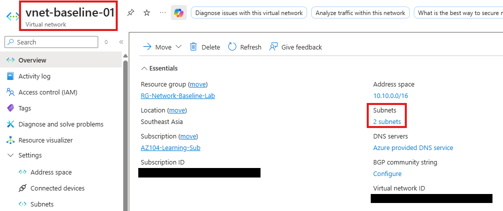
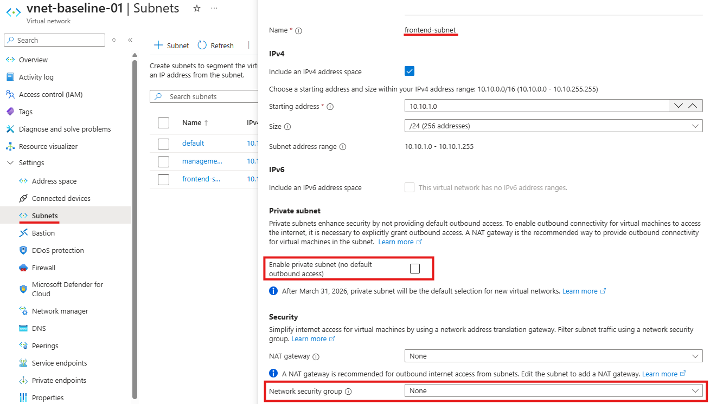
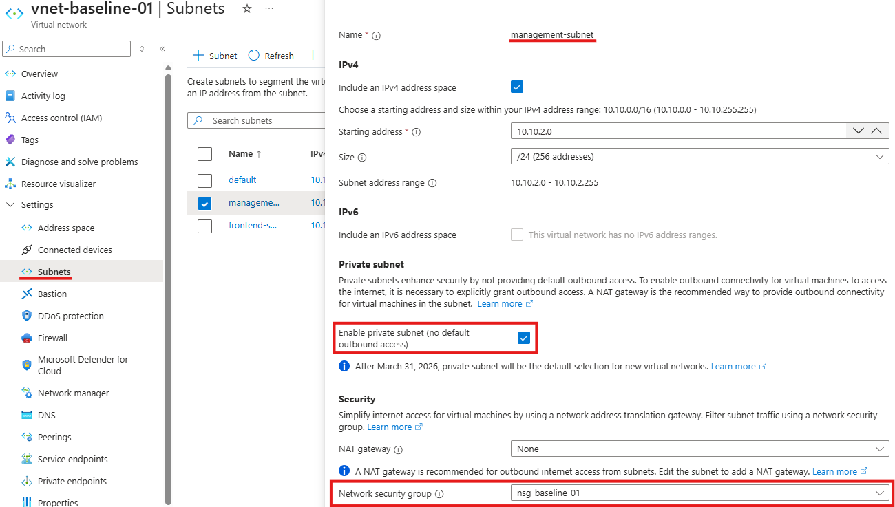
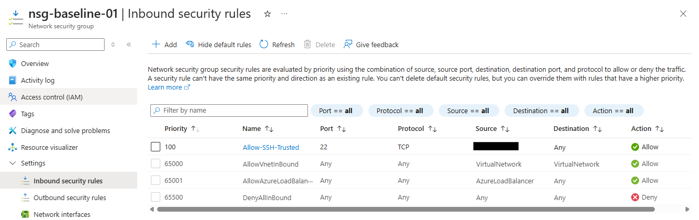
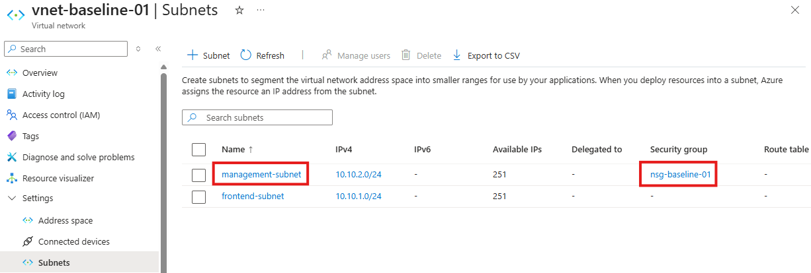

# Azure Networking Baseline

## Overview
This project documents a baseline Azure network design focused on subnet segmentation, intentional network security group use, and safer administrative access control.

The goal was to create a simple but practical networking setup that demonstrates foundational `AZ-104` skills in Azure networking, including virtual network planning, subnet separation, NSG rule evaluation, and subnet-level security association.

Built an Azure networking baseline that reduced unnecessary administrative exposure by using a segmented VNet design, a more restrictive management subnet, and a trusted-source SSH rule enforced through an NSG.

## Business Scenario
A common cloud administration task is deploying a virtual network that separates workload traffic from administrative access while avoiding unnecessary exposure and overly complex design.

This lab simulates a cleaner Azure networking starting point by deploying a virtual network with separate frontend and management subnets, associating a network security group to the management subnet, and allowing administrative SSH access only from a trusted public source.

## What This Project Demonstrates
- Azure virtual network deployment
- subnet segmentation for different trust levels
- subnet-level NSG association
- trusted-source administrative access control
- understanding of Azure default NSG behavior
- practical documentation of Azure networking decisions

## Project Structure
```text
Azure Networking Baseline/
|-- README.md
|-- screenshots/
|   |-- 01-vnet-overview.png
|   |-- 02-frontend-subnet-configuration.png
|   |-- 03-management-subnet-configuration.png
|   |-- 04-nsg-custom-rule.png
|   |-- 05-management-subnet-nsg-association.png
```

## Day 1 Notes

### Objective
Create a baseline Azure network design that demonstrates subnet segmentation, intentional NSG use, and safer administrative access control.

### Configuration Created
- Resource group: `RG-Network-Baseline-Lab`
- Virtual network: `vnet-baseline-01`
- Address space: `10.10.0.0/16`
- Frontend subnet: `frontend-subnet` → `10.10.1.0/24`
- Management subnet: `management-subnet` → `10.10.2.0/24`
- Management subnet private setting: `Enabled`
- Frontend subnet private setting: `Disabled`
- Network security group: `nsg-baseline-01`
- NSG association: `management-subnet`
- Custom inbound rule: `Allow-SSH-Trusted`
- Rule priority: `100`
- Protocol: `TCP`
- Port: `22`
- Source: trusted public IP only
- Action: `Allow`

### Actions Completed
- created a dedicated resource group for the networking lab
- created a virtual network with a single address space of `10.10.0.0/16`
- created two subnets to separate frontend and management traffic
- treated the management subnet more restrictively by enabling private subnet behavior
- created a network security group for the management subnet
- associated the NSG to the management subnet
- created a trusted-source SSH rule instead of allowing broad administrative access
- captured baseline screenshots for VNet overview, subnet configuration, NSG rule configuration, and NSG association

### Baseline Observations
- subnet segmentation was used to avoid a flat network design
- the `management-subnet` was intentionally treated more strictly than the `frontend-subnet`
- a single trusted-source SSH rule was sufficient because Azure NSGs already include a default explicit deny rule for unmatched inbound traffic
- limiting SSH to a trusted source is safer than allowing broad internet access to administrative ports
- subnet-level NSG association provided a clean and explainable baseline design for this project

### Outcome
Created the initial Azure Networking baseline and validated a segmented VNet design with a protected management subnet and an NSG-based trusted administrative access rule.

## Day 2 Notes

### Objective
Review the Azure networking baseline from a segmentation, traffic-control, and administrative access perspective, and document why the selected design is appropriate for a Stage 1 lab.

### Configuration Review
The virtual network and network security group configuration were reviewed with attention to subnet purpose, subnet-level security association, default NSG behavior, and trusted administrative access design.

### Segmentation and Subnet Review
- the VNet was intentionally divided into two subnets rather than left as a flat network
- `frontend-subnet` represented a less restrictive general workload segment
- `management-subnet` represented a more controlled administrative segment
- the management subnet was configured as a private subnet to reflect a stronger security posture
- subnet segmentation was used to make the network design easier to explain and more aligned with practical security thinking

### NSG and Rule Logic Review
- `nsg-baseline-01` was associated at the subnet level to `management-subnet`
- subnet-level association was chosen because it provides a clearer architecture story than relying only on NIC-level controls
- the custom rule `Allow-SSH-Trusted` allowed SSH only from a trusted public source
- the custom rule used priority `100`, which ensured it was evaluated before lower-priority default rules
- the rule set remained intentionally minimal to avoid unnecessary rule sprawl

### Default Rule and Access Behavior Review
- Azure NSGs include a default `AllowVNetInBound` rule, which allows traffic within the virtual network scope
- Azure NSGs also include a default explicit deny rule for unmatched inbound traffic
- because of the existing default deny behavior, an additional custom deny rule was not required in this lab
- trusted-source SSH access was considered sufficient for demonstrating safer administrative access control

### Outcome
The Azure Networking baseline is now documented not only as a working configuration, but also as an intentional segmented design that uses subnet-level NSG control and minimal trusted administrative access.

## Screenshots

### VNet Overview


### Frontend Subnet Configuration


### Management Subnet Configuration


### NSG Custom Rule


### Management Subnet NSG Association


## Lessons Learned
- a stronger network baseline can still remain simple if each subnet and rule has a clear purpose
- subnet-level NSG association is easier to explain architecturally than relying only on NIC-level filtering
- trusted-source administrative access is cleaner than broad internet-facing management rules
- Azure default NSG rules matter and should be understood before adding unnecessary custom rules
- segmentation decisions are easier to document when the subnets represent different trust levels

## Future Extension
A future version of this project could include:
- subnet-level outbound restriction strategy
- NIC-level vs subnet-level NSG comparison
- route table design and custom routing
- Azure Bastion or alternative administrative access design
- VNet peering or hybrid connectivity extension