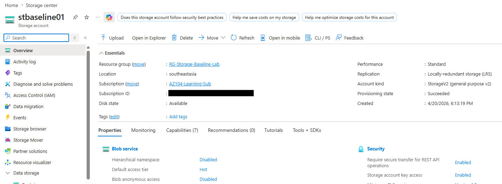
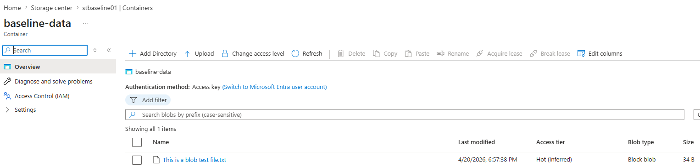
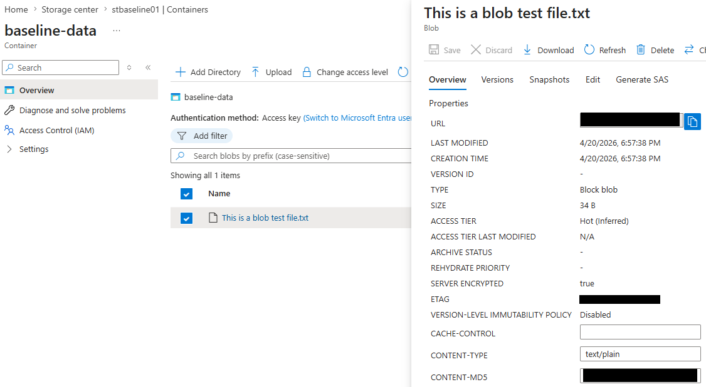

## Day 1 Notes

### Objective
Create a low-cost Azure Storage baseline using a standard storage account, private blob container, and a small test upload.

### Configuration Created
- Resource group: `RG-Storage-Baseline-Lab`
- Storage account: `stbaseline01`
- Region: `Southeast Asia`
- Performance: `Standard`
- Redundancy: `LRS`
- Access tier: `Hot`
- Account kind: `StorageV2`
- Blob anonymous access: `Disabled`
- Secure transfer required: `Enabled`
- Container: `baseline-data`

### Actions Completed
- created the storage account in a dedicated lab resource group
- created a private blob container named `baseline-data`
- uploaded a small test file to validate blob storage usage
- captured baseline screenshots for overview, container view, and uploaded blob details

### Baseline Observations
- `LRS` was selected as the lowest-cost redundancy option appropriate for a small lab
- `Hot` access tier was selected because the blob would be actively used during testing
- anonymous blob access remained disabled, which supports a safer default baseline
- secure transfer was enabled, which aligns with better storage security hygiene

### Outcome
Created the initial Azure Storage baseline and validated blob storage functionality with a successful test upload.

## Screenshots

### Storage Account Overview

### Blob Container View

### Uploaded Test Blob
