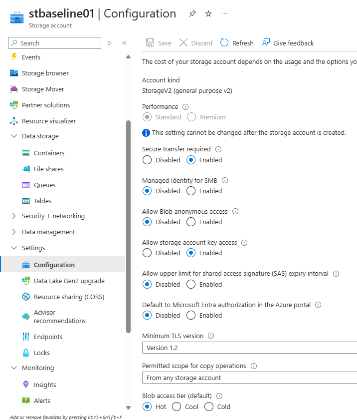
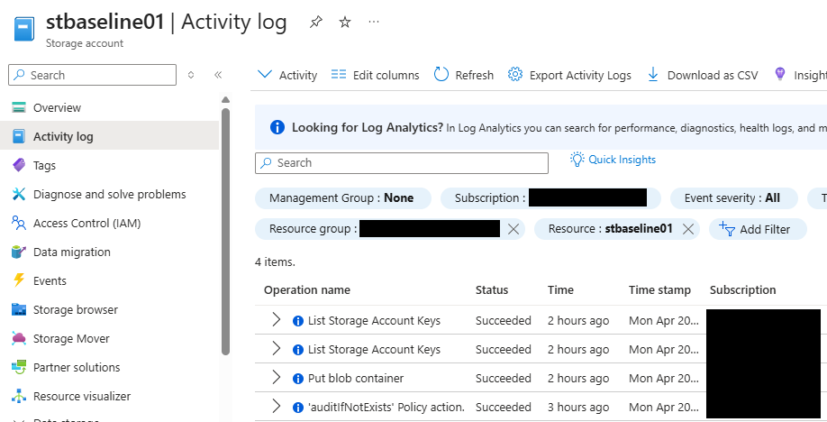

## Day 1 Notes

### Objective
Create a low-cost Azure Storage baseline using a standard storage account, private blob container, and a small test upload.

### Configuration Created
- Resource group: `RG-Storage-Baseline-Lab`
- Storage account: `stbaseline01`
- Region: `Southeast Asia`
- Performance: `Standard`
- Redundancy: `LRS`
- Access tier: `Hot`
- Account kind: `StorageV2`
- Blob anonymous access: `Disabled`
- Secure transfer required: `Enabled`
- Container: `baseline-data`

### Actions Completed
- created the storage account in a dedicated lab resource group
- created a private blob container named `baseline-data`
- uploaded a small test file to validate blob storage usage
- captured baseline screenshots for overview, container view, and uploaded blob details

### Baseline Observations
- `LRS` was selected as the lowest-cost redundancy option appropriate for a small lab
- `Hot` access tier was selected because the blob would be actively used during testing
- anonymous blob access remained disabled, which supports a safer default baseline
- secure transfer was enabled, which aligns with better storage security hygiene

### Outcome
Created the initial Azure Storage baseline and validated blob storage functionality with a successful test upload.

## Day 2 Notes

### Objective
Review the Azure Storage baseline from a security, access, and cost perspective and document why the selected configuration is appropriate for a small Stage 1 lab.

### Configuration Review
The storage account baseline was reviewed with attention to access configuration, transport security, default access behavior, and cost-related settings.

### Security and Access Review
- secure transfer remained enabled to help protect storage traffic in transit
- blob anonymous access remained disabled, which supports a safer default baseline
- storage account key access remained enabled, which provides broad access and should be protected carefully
- default Microsoft Entra authorization in the Azure portal was not enabled in this small baseline
- minimum TLS version was set to `1.2` as part of the transport security posture
- shared access signatures (SAS) were reviewed conceptually as a more limited delegated access method
- Microsoft Entra-based authorization was noted as a more identity-centered access model for modern environments

### Cost and Design Review
- `LRS` remained the most appropriate redundancy choice for a low-cost non-production lab
- `Hot` access tier remained appropriate because the uploaded blob was actively used during testing
- `Standard` performance remained the right choice for a simple lab baseline
- lifecycle management was reviewed conceptually as a future cost-optimization option for aging data
- lifecycle policies were intentionally not configured in this small baseline project to keep the lab simple and focused

### Monitoring and Visibility Review
- basic activity visibility was reviewed through the Azure Activity Log
- basic monitoring visibility was confirmed through the Azure Metrics view
- no advanced monitoring or diagnostic configuration was implemented in this baseline

### Outcome
The Azure Storage baseline is now documented not only as a working configuration, but also as a deliberate low-cost and safer-by-default design choice appropriate for `AZ-104` stage learning.

## Screenshots

### Storage Account Overview

### Blob Container View

### Uploaded Test Blob

### Storage Security Settings

### Storage Activity Log
