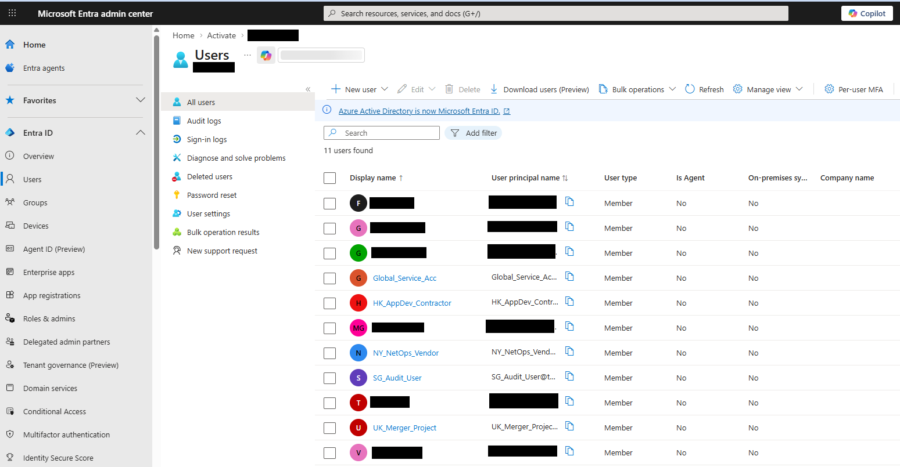
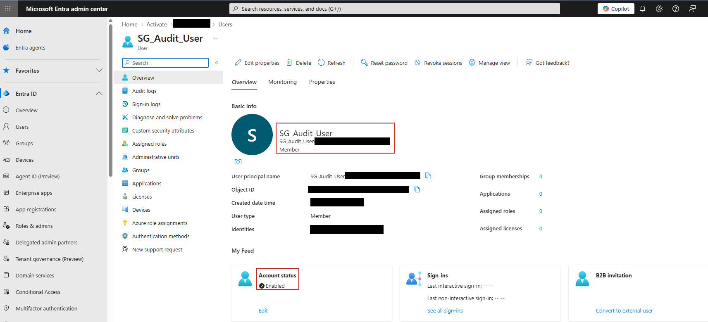
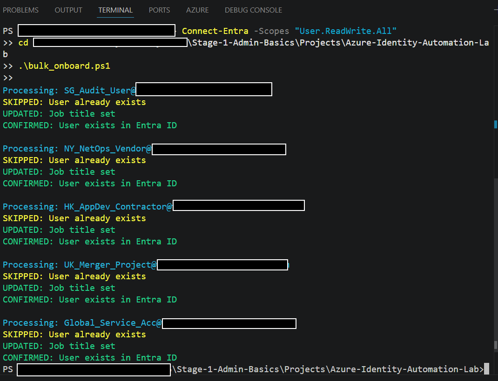

# Azure Identity Automation Lab

## Overview
This project demonstrates identity provisioning and validation in Microsoft Entra ID using PowerShell. It is designed as a practical portfolio project that reflects how cloud administrators and security engineers approach repeatable onboarding tasks in real environments.

The focus is not only on creating users, but on making the workflow safer to rerun and easier to verify.

## Business Scenario
Organizations often need to create multiple users quickly for projects, contractors, audit teams, support teams, or merger-related activity. In many real environments, the challenge is not just provisioning users once, but doing it in a way that avoids duplicate objects, inconsistent results, and unnecessary cleanup.

This project simulates a repeatable onboarding workflow for Microsoft Entra ID with built-in checks and post-run validation.

## What This Project Demonstrates
- Microsoft Entra ID administration
- PowerShell automation for identity tasks
- idempotent provisioning logic
- verification after execution
- safer operational scripting practices

## Technical Highlights
- checks whether a user already exists before trying to create it
- creates users with a structured input list
- separates creation from post-configuration
- verifies that each user exists after the operation completes
- provides readable console output for created, skipped, updated, and confirmed states

## Project Structure
```text
Azure-Identity-Automation-Lab/
|-- README.md
|-- bulk_onboard.ps1
|-- screenshots/
|   |-- README.md
|   |-- entra-users-list.png
|   |-- entra-user-details.png
|   |-- script-output.png
```

## Script
Main script:
- [bulk_onboard.ps1](./bulk_onboard.ps1)

## How to Run
### Prerequisites
- PowerShell 7 or Windows PowerShell with the required Microsoft Entra module available
- access to a Microsoft Entra tenant
- permissions to create and update users

### Example Workflow
1. Connect to Microsoft Entra.
2. Review the hardcoded domain and password settings in the script.
3. Run `bulk_onboard.ps1`.
4. Verify created users in the Entra admin portal.

## Sample Console Output
```text
Processing: SG_Audit_User@teamremote.onmicrosoft.com
CREATED: SG_Audit_User@teamremote.onmicrosoft.com
UPDATED: Job title set
CONFIRMED: User exists in Entra ID

Processing: NY_NetOps_Vendor@teamremote.onmicrosoft.com
SKIPPED: User already exists
UPDATED: Job title set
CONFIRMED: User exists in Entra ID
```

## Screenshots
These images show the workflow being executed and validated in Microsoft Entra ID.

### Users List After Execution


### User Details Validation


### Script Output


## Sample Use Cases
- lab user creation for Azure identity exercises
- contractor onboarding simulation
- merger or project-based onboarding scenarios
- testing idempotent user provisioning logic

## Why This Matters
This project is useful because it shows more than basic scripting. It reflects the mindset required in real environments:
- do not create duplicates
- make reruns safer
- verify outcomes instead of assuming success
- keep the workflow understandable for future support or audit review

## Security and Operational Notes
- the script currently uses inline sample values for the tenant domain and password, which is fine for controlled lab use but should be moved to a safer pattern for production-style automation
- the current version is positioned as a lab and portfolio project, not a production deployment tool
- future versions can externalize user input, improve secret handling, and add audit logging

## Future Improvements
- move configuration values to environment variables or a secure input model
- add JSON or CSV-driven user input
- add group assignment support
- add role assignment logic where appropriate
- write logs to file for audit visibility
- add screenshots showing portal verification

## Portfolio Positioning
A strong summary for this project is:

"Built a Microsoft Entra ID onboarding automation workflow in PowerShell with idempotent checks, post-configuration steps, and verification logic to support repeatable identity provisioning in a lab environment."

## Recruiter and Client Value
This project supports conversations around:
- Entra ID administration
- identity automation
- access governance hygiene
- Azure admin support
- hybrid cloud operational readiness
