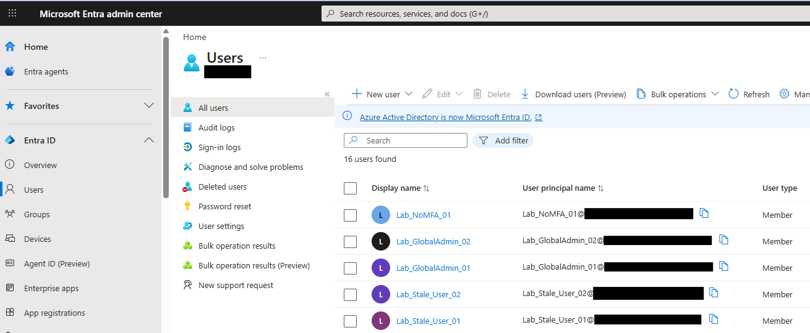
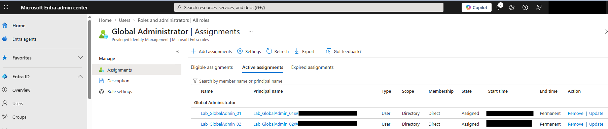
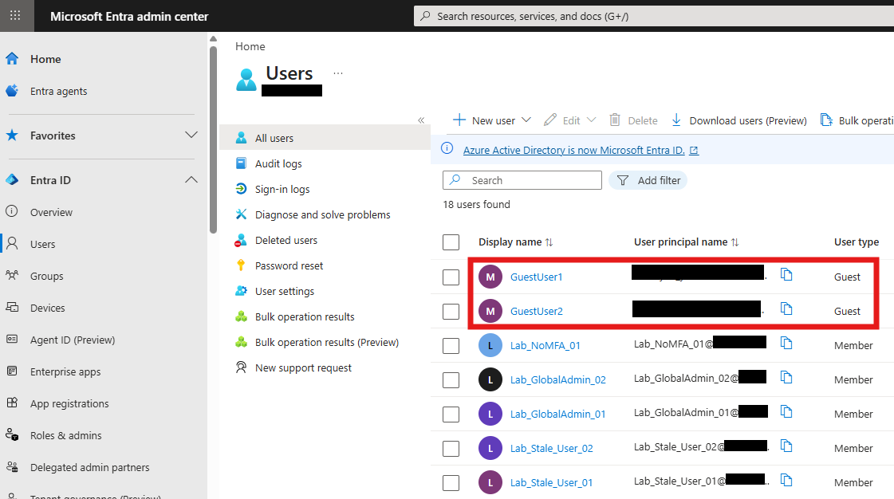
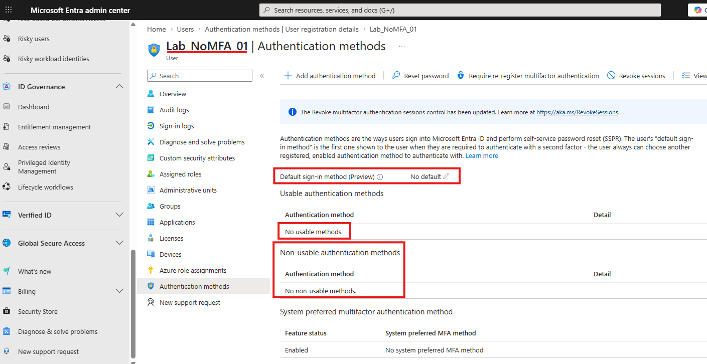
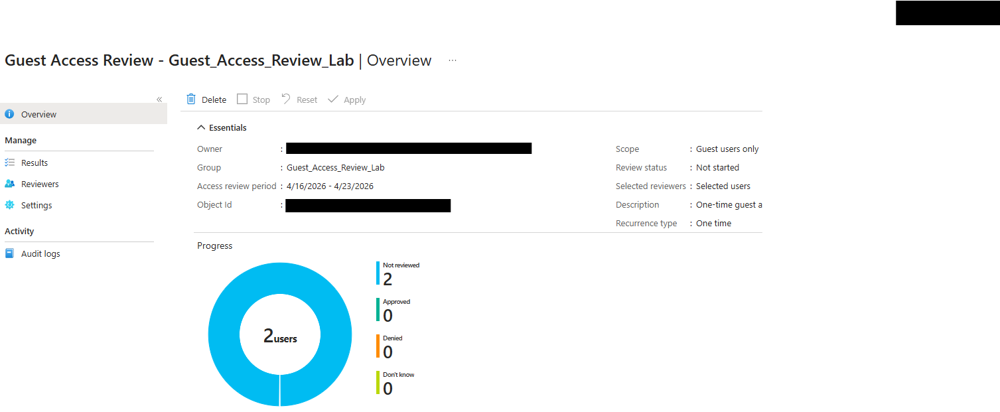
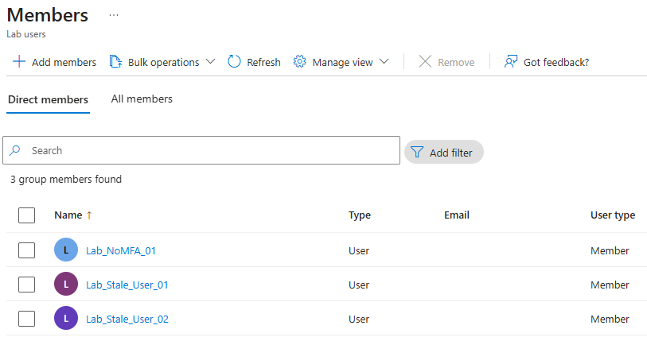

# Microsoft Entra Identity Hygiene Framework

## Overview
This project documents a lightweight Microsoft Entra ID identity hygiene lab focused on guest access governance, standing privilege discovery, and MFA readiness review.

The goal was to build a small but realistic baseline identity scenario, identify key risks, and implement a first governance control without moving too far beyond the current `AZ-104` learning stage.

Improved Microsoft Entra identity governance by implementing a guest access review workflow, resulting in a more controlled approach to external access while documenting future Conditional Access hardening steps.


## Business Scenario
Organizations often accumulate identity risk through stale accounts, guest access that is not regularly reviewed, standing privileged assignments, and users who are not ready for MFA enforcement.

This lab simulates a small identity cleanup and governance scenario inside Microsoft Entra ID and focuses on building a more controlled approach to guest access and privilege visibility.

## What This Project Demonstrates
- Microsoft Entra ID user and guest identity administration
- direct privileged role assignment review
- guest access governance using Access Reviews
- MFA readiness gap identification
- practical identity hygiene documentation for future security hardening

## Project Structure
```text
Microsoft Entra Identity Hygiene Framework/
|-- README.md
|-- screenshots/
|   |-- 01-member-users-baseline.png
|   |-- 02-standing-global-admins.png
|   |-- 03-guest-users-present.png
|   |-- 04-no-mfa-user-baseline.png
|   |-- 05-guest-access-review-created.png
|   |-- 06-lab-users-group-members.png
```

## Day 1 Notes

### Objective
Prepare a small lab tenant state that can be reviewed and improved through identity governance and hardening actions.

### Lab State Created
The tenant was prepared with a small set of test identities to simulate common identity hygiene issues.

Created member users:
- Lab_Stale_User_01
- Lab_Stale_User_02
- Lab_GlobalAdmin_01
- Lab_GlobalAdmin_02
- Lab_NoMFA_01

Created guest users:
- GuestUser1
- GuestUser2

### Baseline Findings
The initial identity review identified the following conditions:

- 2 guest users are present in the tenant
- 2 users have standing Global Administrator role assignments
- 1 user has no usable authentication methods configured
- multiple lab users were created to represent stale or reviewable identities

### Security Observations
- Lab_GlobalAdmin_01 and Lab_GlobalAdmin_02 were assigned Global Administrator as active permanent assignments to simulate standing privilege
- Lab_NoMFA_01 was left without usable authentication methods to represent MFA readiness risk
- Guest users were added to support later governance review scenarios

### Outcome
The lab environment is prepared for identity review and hardening.

## Day 2 Notes

### Objective
Introduce a basic governance control and review the current privileged access and MFA baseline without making broader tenant-wide security changes.

### Actions Taken
- Created a guest access review for the Guest_Access_Review_Lab group
- Configured the review as a one-time review with auto-apply results enabled
- Configured non-response to remove access
- Configured denied guest users to be removed from the reviewed resource
- Confirmed that two guest users are currently in scope for governance review

### Additional Review Findings
- Standing Global Administrator assignments remain present for Lab_GlobalAdmin_01 and Lab_GlobalAdmin_02
- Lab_NoMFA_01 remains without usable authentication methods and represents a baseline MFA readiness gap

### Conditional Access Decision Point
A report-only Conditional Access policy was prepared for the Lab users group. However, the tenant currently has Security Defaults enabled, which must be disabled before Conditional Access policies can be enabled.

For this lighter AZ-104-aligned version of the project, Security Defaults were left enabled and Conditional Access implementation was intentionally deferred.

### Summary
Improved Microsoft Entra identity governance by implementing a guest access review workflow, resulting in a more controlled approach to external access while documenting future Conditional Access hardening steps.

### Outcome
The tenant now includes a working guest governance control, while more advanced policy-based identity hardening has been identified as a future extension better aligned with AZ-500.

## Screenshots

### Member Users Baseline


### Standing Global Administrators


### Guest Users Present


### No MFA User Baseline


### Guest Access Review Created


### Lab Users Group Members


## Lessons Learned
- identity hygiene work is stronger when it includes governance controls, not just account cleanup
- guest access should be reviewed through a repeatable process rather than manually handled case by case
- standing privileged access is easy to identify but should be improved carefully and deliberately
- MFA readiness gaps are easier to document when test identities are structured intentionally
- Conditional Access introduces stronger policy control, but it also introduces broader tenant design decisions that are better handled in a more security-focused phase

## Future Extension
This lighter version fits well within Stage 1 and supports `AZ-104` identity and access learning.

A future extension of this project under `AZ-500` could include:
- Conditional Access implementation after disabling Security Defaults
- stronger privileged access controls
- deeper MFA enforcement analysis
- broader identity protection and governance workflows
