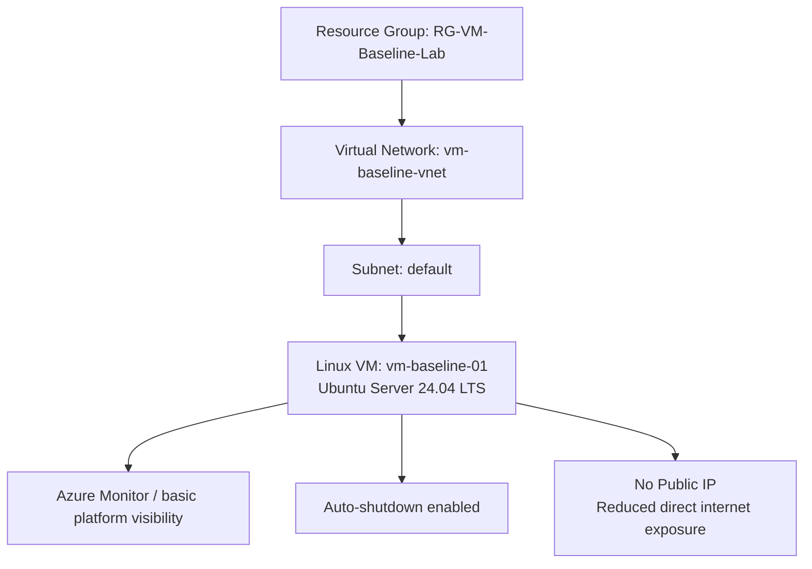
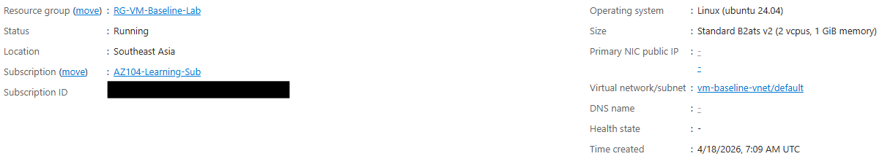
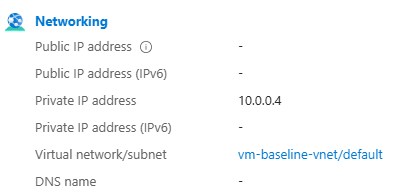
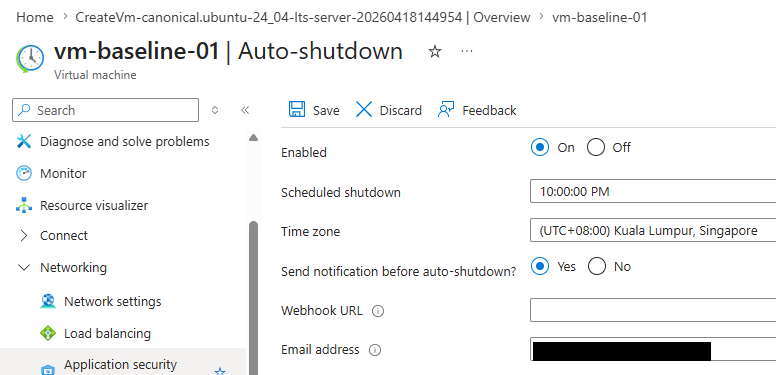
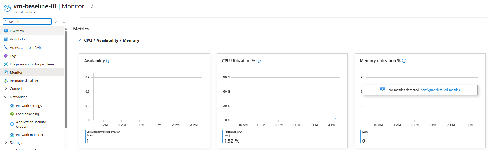

# Secure Azure VM Baseline

## Overview
This project documents a lightweight Azure virtual machine baseline focused on secure deployment, reduced public exposure, and cost-conscious administration.

The goal was to create a simple but practical VM setup that demonstrates foundational `AZ-104` skills in compute, networking, and operational hygiene without overcomplicating the environment.

Built a secure Azure VM baseline that reduced unnecessary exposure by deploying the VM without a public IP, adding basic monitoring visibility, and enabling auto-shutdown for cost-conscious administration.


## Business Scenario
A common early cloud administration task is deploying a virtual machine for testing, administration, or internal workloads without exposing it unnecessarily to the internet.

This lab simulates a safer starting point by deploying a Linux VM without a public IP, placing it inside a dedicated virtual network, and enabling basic operational controls such as auto-shutdown and platform monitoring visibility.

## What This Project Demonstrates
- Azure virtual machine deployment
- virtual network and subnet placement
- reduced inbound exposure by deploying the VM without a public IP
- reduced administrative exposure
- cost-aware VM operations
- basic monitoring visibility in Azure

## Simple Architecture View



This diagram shows the baseline intent of the lab: keep the environment simple, reduce direct exposure, and preserve basic operational visibility without overbuilding the first-stage design.

## Project Structure
```text
Secure-Azure-VM-Baseline/
|-- README.md
|-- screenshots/
|   |-- 01-vm-overview.png
|   |-- 02-networking-private-only.png
|   |-- 03-auto-shutdown-enabled.png
|   |-- 04-monitor-baseline.png
```

## Baseline Configuration
The VM was deployed with the following baseline choices:

- Resource group: RG-VM-Baseline-Lab
- VM name: vm-baseline-01
- Region: Southeast Asia
- OS: Ubuntu Server 24.04 LTS
- Authentication: SSH public key
- Public IP: none
- Virtual network: vm-baseline-vnet
- Subnet: default
- Auto-shutdown: enabled
- Boot diagnostics: enabled with managed storage

## Key Security and Cost Decisions
- the VM was deployed without a public IP, preventing direct inbound internet access
- no inbound administrative exposure was enabled by default
- auto-shutdown was enabled to reduce unnecessary runtime cost
- the VM was placed in a dedicated lab resource group for easier cleanup
- the configuration intentionally stayed simple and aligned with Stage 1 administration goals
- Azure still indicated default outbound internet access behavior for the subnet, which is a useful reminder that removing a public IP does not automatically eliminate all outbound connectivity paths


## Screenshots





## Lessons Learned
- a secure baseline does not always require complex controls; removing unnecessary exposure is already a strong first step
- private-only networking is often a better default than opening management access too early
- cost-control settings like auto-shutdown are part of good cloud administration, not just billing hygiene
- a clean and minimal baseline makes future hardening and documentation easier

## Future Extension
A future version of this project could include:

- controlled administrative access from a trusted source IP
- NSG rules for tightly scoped inbound management
- Bastion-based access
- deeper Azure Monitor or VM Insights integration
- RBAC and identity-aware administrative access patterns
